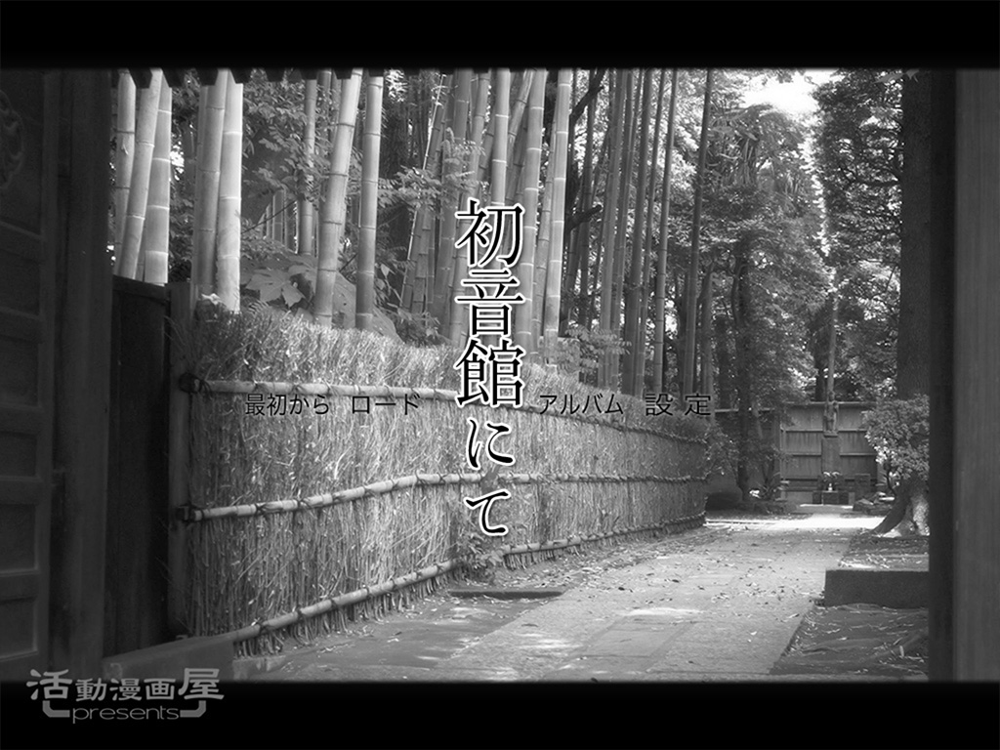
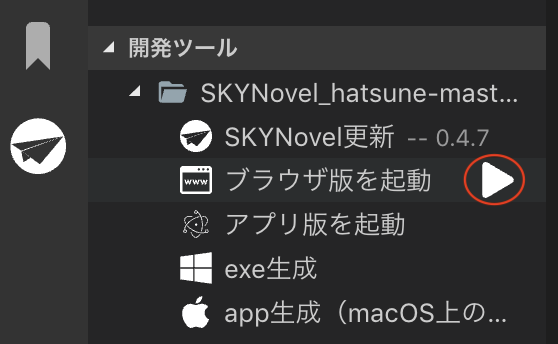

# Novelgame(Yoko-gaki) sample project

[CHANGELOG.md](CHANGELOG.md)

---
## description（説明）

[江戸川乱歩](https://www.aozora.gr.jp/index_pages/person1779.html)「孤島の鬼」二次創作ノベルゲームサンプルです。

## usage（使用法）

### インストールと環境設定
1. 開発者情報[「SKYNovelのはじめかた」〜「テンプレートで始めよう」直前](https://famibee.github.io/SKYNovel/dev.htm)までの手順を終えてください。
2. 「テンプレートで始めよう」の手順に従って、このサイトの zip ファイルを解凍し、ブラウザ実行できます。
3. そのまま開発を始められます。

### 普段の開発（ブラウザ版、アプリ版を作りたい人も手軽なので推奨）
1. 「Activity Bar」SKYNovelを選択します。
2. 「ブラウザ版を起動」右の【再生ボタン】をクリック。

3. 自動でブラウザを開き、ブラウザ版が起動します。

### 普段の開発（アプリ版）
1. 「アプリ版を起動」右の【再生ボタン】をクリック。
2. サンプルアプリが起動します。

### 配布用アプリパッケージ作成（アプリ版）
1. 「exe生成」または「app生成（macOS上のみ）」右のボタンをクリック。
	* Mac版は macOS 上でのみ、作成可能です。
2. （プロジェクトフォルダ）/build/ 下に（Windowsでは）「（アプリ名） Setup.exe」が生成されています。これを配布します。
	* （Macでは）「（アプリ名）-1.0.0.dmg」が生成されています。これを配布します。

---
## 拡張機能 / Extension
 - [SKYNovel - Visual Studio Marketplace](https://marketplace.visualstudio.com/items?itemName=famibee.skynovel)

## License ... [MIT](LICENSE)

## Famibee is ?
- [WebSite : 電子演劇部](https://famibee.blog.fc2.com/)
- [Github](https://github.com/famibee/SKYNovel)
- [npm](https://www.npmjs.com/package/skynovel)
- Twitter ([famibee](https://twitter.com/famibee))

## Thanks (2012当時)
- 原作──江戸川乱歩[「孤島の鬼」](http://www.amazon.co.jp/dp/4488401015)
- 二次創作──夕街昇雪[「人形城奇譚」](http://ugainovel.blog112.fc2.com/)
- 画像素材──[「鳥山石燕」](http://ja.wikipedia.org/wiki/鳥山石燕)
- ことり　さま[「ｃｏｔｏｒｉ　ｂｌｏｇ」](http://blog.livedoor.jp/globule_cotori/)
- 早川さま「明治村画像庫」(http://d.hatena.ne.jp/meiji_photo/)
- [「２０００ピクセル以上のフリー写真素材集」](http://sozai-free.com/)
- ゆん　さま[「ゆん無料壁紙画像集」](http://wallpaper.free-photograph.net/jp/)
- 参加写真家各位[「写真素材　足成」](http://www.ashinari.com/)
- 創作者各位[「ウィキメディア・コモンズ」](http://commons.wikimedia.org/wiki/Main_Page)
- シルエット立ち絵──ちぃさま[「びたちー素材館」](http://www.vita-chi.net/sozai1.htm)
- ＢＧＭ──ＳＥＮＴＩＶＥさま[「ＳＬＯＳ」](http://slos.biz/)
- 効果音──おさびしゆうき　さま[「ザ・マッチメイカァズ」](http://osabisi.sakura.ne.jp/m2/)
- 効果音──ＳＹＮＣ　ＴＨＩＮＫ　ＴＡＮＫ　さま[「ウェッブ・ウェイブ・リブ」](http://www.s-t-t.com/wwl/)
- フォント──ＩＰＡ明朝[「独立行政法人　情報処理推進機構」](http://www.ipa.go.jp/)
- フォント──ＸＡＮＯ明朝Ｕ３２[「内田 明」](http://www.ipa.go.jp/)」
